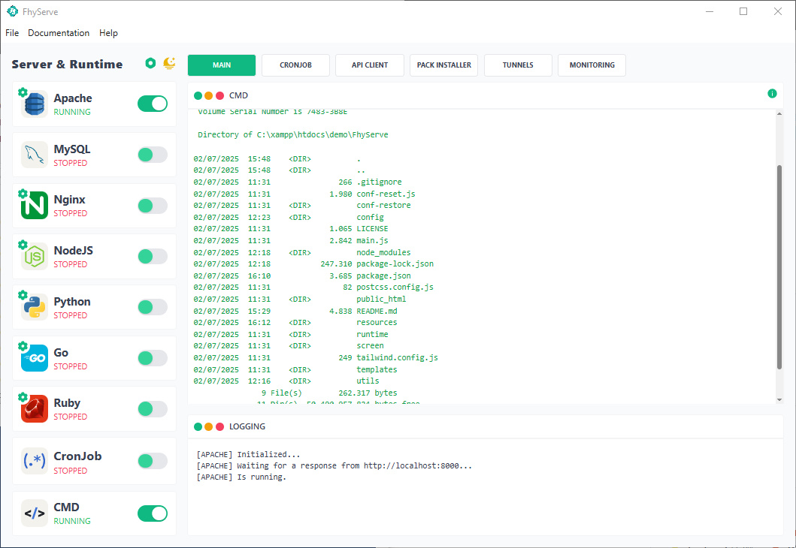

<div align="center">

[](https://github.com/fitri-hy/FhyServe/releases/latest)
[](https://github.com/fitri-hy/FhyServe/stargazers)
[](https://github.com/fitri-hy/FhyServe/network/members)
[](https://github.com/fitri-hy/FhyServe/releases)
[](https://github.com/fitri-hy/FhyServe/graphs/contributors)
[](https://github.com/fitri-hy/FhyServe/issues)
[](https://github.com/fitri-hy/FhyServe/pulls)
[](https://github.com/fitri-hy/FhyServe/commits/main)
[](https://www.electronjs.org/)
[](https://nodejs.org/)

</div>

# 🚀 FhyServe

*"Full Server Control, No Environment!"*

**FhyServe** is a portable **multi-server runtime** platform designed to simplify local web application development without the need for global installation. Allows you to run multiple environments.

---

## ⚙️ Included Available

- 🐘 **PHP & PHP-FPM** 
- 🧰 **Apache**
- 🚀 **NGINX**
- 🟢 **Node.js**
- 🐍 **Python**
- 🐬 **MySQL**
- 🗂 **phpMyAdmin**
- 🐙 **Git**
- 💻 **CMD**
- ⏰ **Cron Job**
- 📡 **Client API**
- 📊 **Monitoring**
- 📦 **Composer**
- 🐭 **Go**
- 💎 **Ruby**
- 🧱 **CMS & Framework Auto Installer Package.**
- 🛰️ **Local Tunels**

#### CMS Package Included

- Wordpress
- Joomla

#### Framework Package Included

- Laravel
- CodeIgniter
- Symfony
- Slim
- Yii
- CakePHP

---

## 📥 Latest Release

Get the latest version of **FhyServe** via the following official link:
[**Download Latest Release**](https://github.com/fitri-hy/FhyServe/releases/latest)

---
## 🛠️ Development Installer

```
git clone https://github.com/fitri-hy/FhyServe.git
npm install
npm start
```

**Build**

```
npm run build
```

### Download Resources Manually (Optional)

> FhyServe has implemented **Automatic Resource Check & Download** so you don't need to download manually.

If you still want to download the resources manually, please use the following link or download the **resources-development.zip** in the releases section

| 🔗 Resource    | 📥 Official Link |
|----------------|------------------|
| **NGINX**      | [nginx-1.28.0](https://nginx.org/en/download.html/) |
| **PHP**        | [php-8.3.22-Win32-vs16-x64](https://windows.php.net/downloads/releases/) |
| **PHP-FPM**    | [php-8.3.22-nts-Win32-vs16-x64](https://windows.php.net/download/) |
| **phpMyAdmin** | [phpMyAdmin-5.2.2-all-languages](https://www.phpmyadmin.net/downloads/) |
| **MySQL**      | [mysql-8.4.5-winx64](https://dev.mysql.com/downloads/mysql/) |
| **Apache**     | [httpd-2.4.63-250207-win64-VS17](https://www.apachelounge.com/download/) |
| **NodeJS**     | [node-v22.17.0-win-x64](https://nodejs.org/en/download) |
| **Python**     | [python-3.13.5-embed-amd64](https://www.python.org/downloads/windows/) |
| **Git**        | [MinGit-2.50.0-64-bit](https://github.com/git-for-windows/git/releases/tag/v2.50.0.windows.1) |
| **Composer**   | [composer-setup](https://getcomposer.org/download/) |
| **Go**         | [go1.24.4.windows-amd64.zip](https://go.dev/dl/) |
| **Ruby**         | [rubyinstaller-3.4.4-2-x64.7z](https://github.com/oneclick/rubyinstaller2/releases) |

**Folder Structure for Resource Placement**

```
FhyServe/
├── resource/
│   ├── apache/
│   ├── composer/
│   ├── git/
│   ├── go/
│   ├── mysql/
│   ├── nginx/
│   ├── nidejs/
│   ├── php/
│   ├── php-fpm/
│   └── python/
│   ├── ruby/
└── public_html/
    └── apache_web/
        └── phpmyadmin/
```

---

## 📜 Lisensi

MIT License © 2025 – FhyLabs Team.

---

## 🤝 Contribution

Contributions are very welcome!.
Please feel free to fork this repo, create an issue, or submit a pull request for new features or performance improvements 🚀