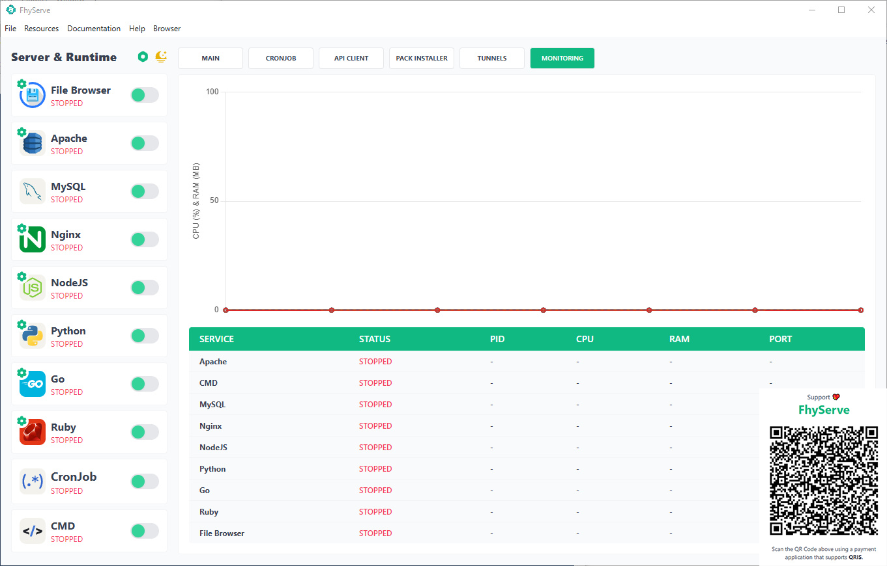

<div align="center">

[](https://github.com/fitri-hy/FhyServe/releases/latest)
[](https://github.com/fitri-hy/FhyServe/stargazers)
[](https://github.com/fitri-hy/FhyServe/network/members)
[](https://github.com/fitri-hy/FhyServe/releases)
[](https://github.com/fitri-hy/FhyServe/graphs/contributors)
[](https://github.com/fitri-hy/FhyServe/issues)
[](https://github.com/fitri-hy/FhyServe/pulls)
[](https://github.com/fitri-hy/FhyServe/commits/main)
[](https://www.electronjs.org/)
[](https://nodejs.org/)

</div>

# 🚀 FhyServe

*"Full Server Control, No Environment!"*

**FhyServe** is a portable **multi-server runtime** platform designed to simplify local web application development without the need for global installation. Allows you to run multiple environments.

---

## ⚙️ Included Available

* 🐘 **PHP & PHP-FPM**
* 🧰 **Apache**
* 🚀 **NGINX**
* 🟢 **Node.js**
* 🐍 **Python**
* 🐬 **MySQL**
* 🗂 **phpMyAdmin**
* 🐙 **Git**
* 💻 **CMD**
* ⏰ **Cron Job**
* 📡 **Client API**
* 📊 **Monitoring**
* 📦 **Composer**
* 🐭 **Go**
* 💎 **Ruby**
* 🗃 **File Browser**
* 🟥 **Redis**
* 🧱 **CMS & Framework Auto Installer Package**
* 🛰️ **Local Tunnels**


#### CMS Package Included

- Wordpress
- Joomla

#### Framework Package Included

- Laravel
- CodeIgniter
- Symfony
- Slim
- Yii
- CakePHP

---

## 📥 Latest Release

Get the latest version of **FhyServe** via the following official link:
[**Download Latest Release**](https://github.com/fitri-hy/FhyServe/releases/latest)

| 🔗 Resource    | 📥 Version |
|----------------|------------------|
| **NGINX**      | Nginx 1.28.0 |
| **PHP**        | PHP 8.3.22 |
| **PHP-FPM**    | PHP 8.3.22-nts |
| **phpMyAdmin** | PHPMyAdmin 5.2.2 |
| **MySQL**      | MySQL 8.4.5 |
| **Apache**     | HTTPD 2.4.63 |
| **NodeJS**     | Node 22.17.0 |
| **Python**     | Python-3.13.5 |
| **Git**        | MinGit 2.50.0 |
| **Composer**   | Composer 2.8.9 |
| **Go**         | Go 1.24.4 |
| **Ruby**       | Ruby 3.4.4-2 |
| **File Browser**       | File Browser 2.52.0 |
| **Redis**       | Redis 5.0.14 |

---

## ⚙️ Install

```
npm install
npm start

#or
npm run dev
```

---

## 🛠️ Build

```
npm run build
```

---

## 🔐 Generate Self-Signed Certificate (Testing Only)

```
$cert = New-SelfSignedCertificate -Type CodeSigning -Subject "CN=FhyLabs Group" -KeyExportPolicy Exportable -CertStoreLocation "Cert:\CurrentUser\My"
$pwd = ConvertTo-SecureString -String "fhylabs123" -Force -AsPlainText
Export-PfxCertificate -Cert $cert -FilePath ".\signkeys\fhyabs_cert.pfx" -Password $pwd
```

---

## 📜 Lisensi

MIT License © 2025 – FhyLabs Team.

---

## 🤝 Contribution

Contributions are very welcome!.
Please feel free to fork this repo, create an issue, or submit a pull request for new features or performance improvements 🚀

Thank you for your support: 
* [kelasfullstack.id](https://www.instagram.com/p/DLrgC-Eyxa3)
* [codepolitan](https://www.instagram.com/p/DLrgC-Eyxa3)
* [Aqsa-Jimmy](https://www.facebook.com/share/p/19YR5JbiTP/)
* [jagoanhosting](https://www.instagram.com/p/DMAH8m3Ssn_/)
